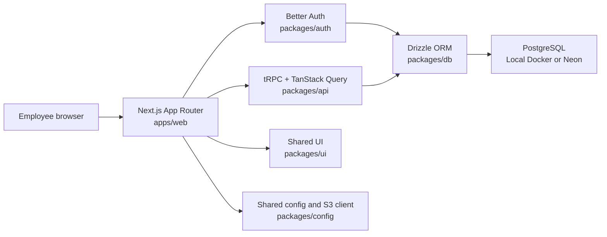

# Architecture

## Purpose

SHWE LIN PAN is an authenticated internal dashboard for exchange, Cash/Bank, expense,
rate, balance, and summary operations. It is implemented as a Bun workspace managed by
Turborepo.

## System overview

The browser renders the Next.js application. Authentication and tRPC requests are
verified on the server. Business calculations execute in the API package, and Drizzle
persists records in PostgreSQL.

## Workspaces

| Workspace         | Responsibility                                                                           |
| ----------------- | ---------------------------------------------------------------------------------------- |
| `apps/web`        | Next.js routes, dashboard UI, localization, tRPC client, and TanStack Query              |
| `packages/api`    | Protected tRPC procedures, validation, calculations, summaries, and integration tests    |
| `packages/auth`   | Better Auth configuration, active-account checks, account lifecycle CLI, and auth tests  |
| `packages/db`     | PostgreSQL client, Drizzle schema, migrations, and test database preparation             |
| `packages/ui`     | Shared UI primitives and utilities                                                       |
| `packages/config` | Shared TypeScript, ESLint, Prettier, environment validation, and S3 client configuration |
| `packages/types`  | Shared infrastructure types                                                              |

Internal workspaces are imported through `@repo/*` and use `workspace:*` dependencies.

## Request flows

### Sign in

1. The login form sends an email/password request to the Better Auth endpoint.
2. Better Auth validates the origin, password, and the user's `active` status.
3. A successful response creates a server-verified session cookie.
4. Protected layouts redirect unauthenticated or inactive users to `/login`.

Public registration is disabled in the application. The CLI temporarily enables the
Better Auth sign-up operation only while provisioning an administrator-selected
account.

### Protected dashboard query

1. The Next.js server or tRPC handler builds a request context.
2. `packages/auth` resolves the active session.
3. `protectedProcedure` rejects requests without an active session.
4. The API validates inputs with Zod, performs exact-decimal calculations, and queries
   PostgreSQL through Drizzle.
5. TanStack Query manages client caching and invalidation after mutations.

### Transaction mutation

1. The API validates the transaction date, direction, amounts, rate data, and reason
   fields.
2. Exchange and Cash/Bank values are calculated on the server.
3. The transaction and its relevant audit revision are written in a database
   transaction.
4. Client queries are invalidated so Dashboard totals and transaction lists are
   recalculated from current database records.

## Financial value handling

Money and exchange rates cross package boundaries as decimal strings. Calculations use
scaled `bigint` values:

- Money scale: four fractional digits
- Rate scale: eight fractional digits

This avoids JavaScript floating-point rounding in financial calculations. PostgreSQL
stores money as `numeric(20,4)` and rates as `numeric(18,8)`.

## Time and localization

- Operational dates use calendar-date strings.
- Timestamp columns use timezone-aware PostgreSQL timestamps where transaction ordering
  requires an exact time.
- The dashboard uses the `Asia/Yangon` operating timezone.
- The interface supports English and Burmese.

## Deployment boundary

- Local PostgreSQL runs through Docker Compose.
- The current staging web application runs on Netlify.
- The current staging PostgreSQL database runs on Neon.
- S3-compatible storage is configured as infrastructure preparation; no business upload
  feature is part of the current scope.

See [DEPLOYMENT.md](DEPLOYMENT.md) for hosting details and
[DATABASE.md](DATABASE.md) for migration rules.
